## Готовый докер
Возьми официальный докер-образ с nginx и выкачай его при помощи docker pull.

Проверь наличие докер-образа через docker images.
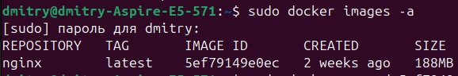

Запусти докер-образ через docker run -d
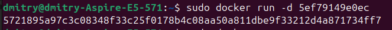

Проверь, что образ запустился через docker ps.
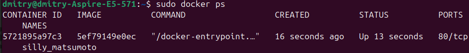

Посмотри информацию о контейнере через docker inspect 
По выводу команды определи и помести в отчёт размер контейнера, список замапленных портов и ip контейнера.
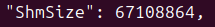
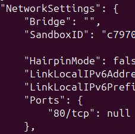
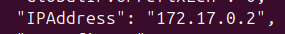

Останови докер контейнер через docker stop 
Проверь, что контейнер остановился через docker ps.
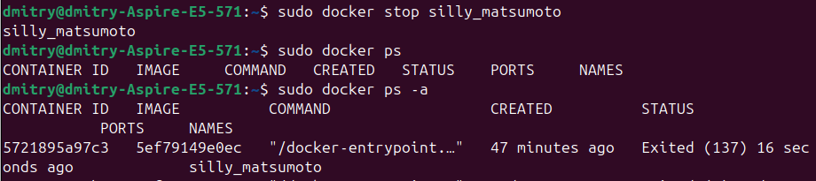

Запусти докер с портами 80 и 443 в контейнере, замапленными на такие же порты на локальной машине, через команду run.Проверь, что в браузере по адресу localhost:80 доступна стартовая страница nginx.
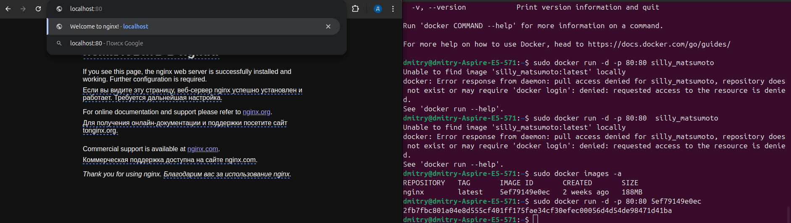
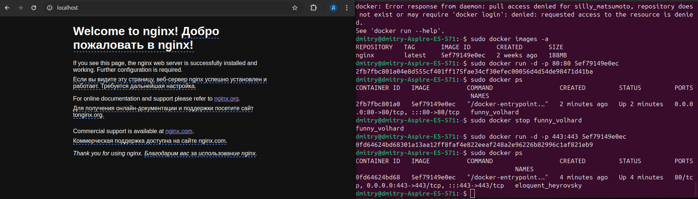

Перезапусти докер контейнер через docker restart
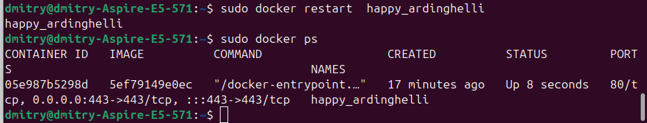

## Операции с контейнером

Прочитай конфигурационный файл nginx.conf внутри докер контейнера через команду exec.
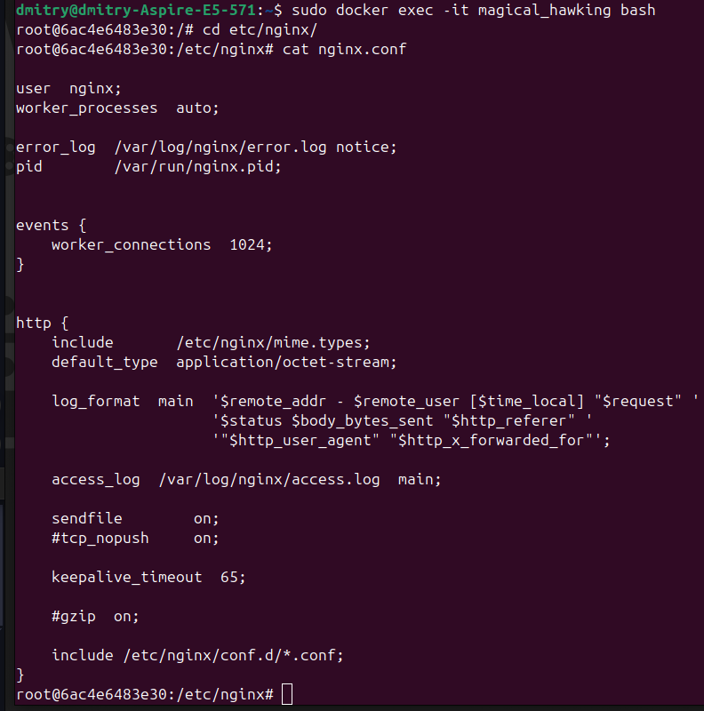

Создай на локальной машине файл nginx.conf.Настрой в нем по пути /status отдачу страницы статуса сервера nginx.
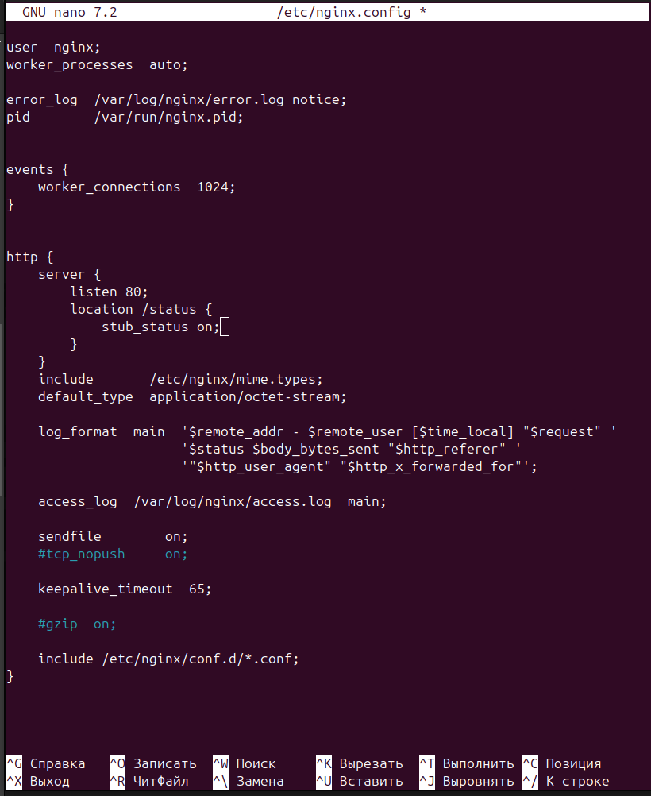
сначала не посмотрел но позже переменовал в nginx.conf

Скопируй созданный файл nginx.conf внутрь докер-образа через команду docker cp.Перезапусти nginx внутри докер-образа через команду exec.Проверь, что по адресу localhost:80/status отдается страничка со статусом сервера nginx, я проверял чеез curl.
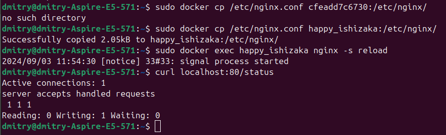

Экспортируй контейнер в файл container.tar через команду export.Останови контейнер.
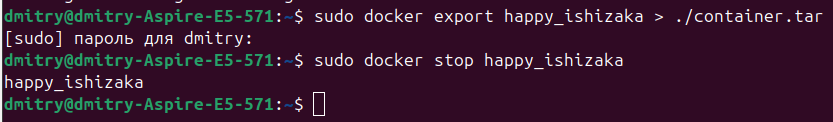

Удали образ через docker rmi [image_id|repository], не удаляя перед этим контейнеры.
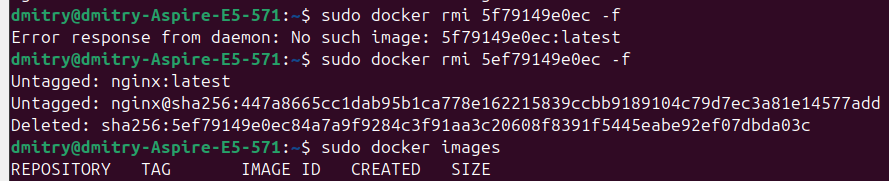

Удали остановленный контейнер. Так как я до этого насоздавал кучу контейнеров, нашел решение как удалить все и разом
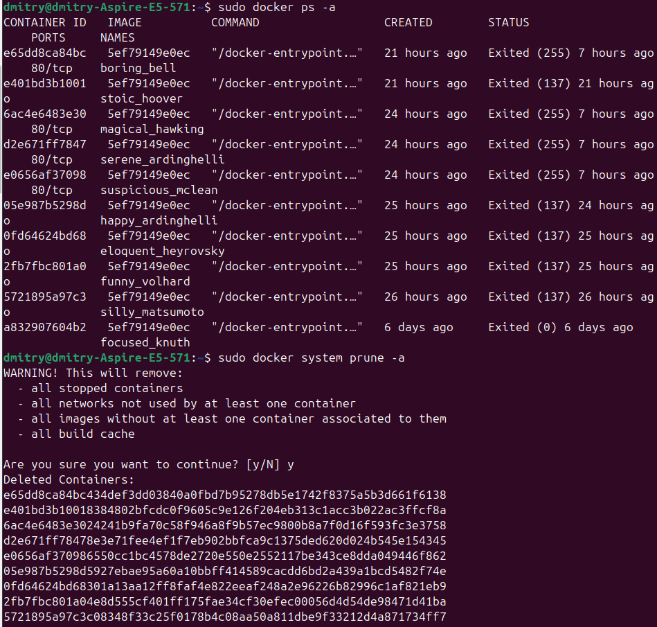
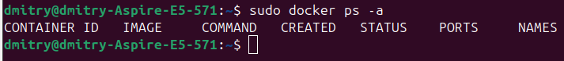

Импортируй контейнер обратно через команду import.Запусти импортированный контейнер.Проверь, что по адресу localhost:80/status отдается страничка со статусом сервера nginx так же для проверки использовал curl.
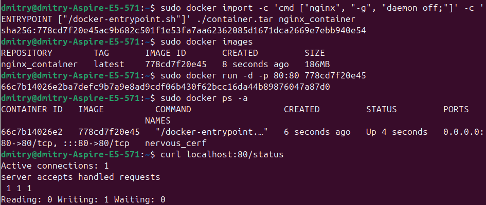

## Мини веб-сервер

Проверь, что в браузере по localhost:81 отдается написанная тобой страничка.
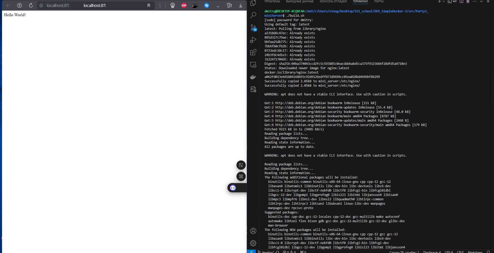

##  Свой докер

Собери написанный докер-образ через docker build при этом указав имя и тег. Проверь через docker images, что все собралось корректно.
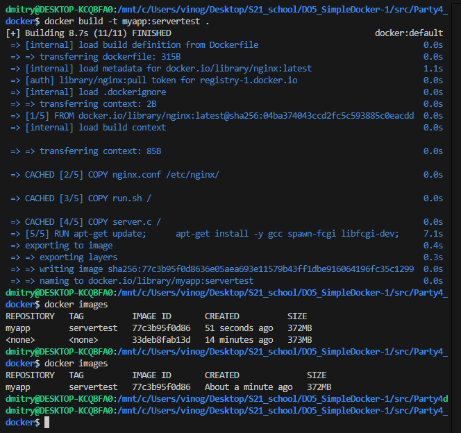

Запусти собранный докер-образ с маппингом 81 порта на 80 на локальной машине и маппингом папки ./nginx внутрь контейнера по адресу, где лежат конфигурационные файлы nginx'а (см. Часть 2).
Проверь, что по localhost:80 доступна страничка написанного мини сервера.
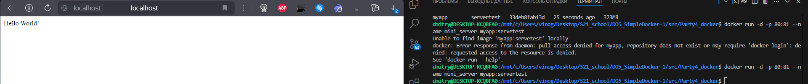

Допиши в ./nginx/nginx.conf проксирование странички /status, по которой надо отдавать статус сервера nginx.Проверь, что теперь по localhost:80/status отдается страничка со статусом nginx
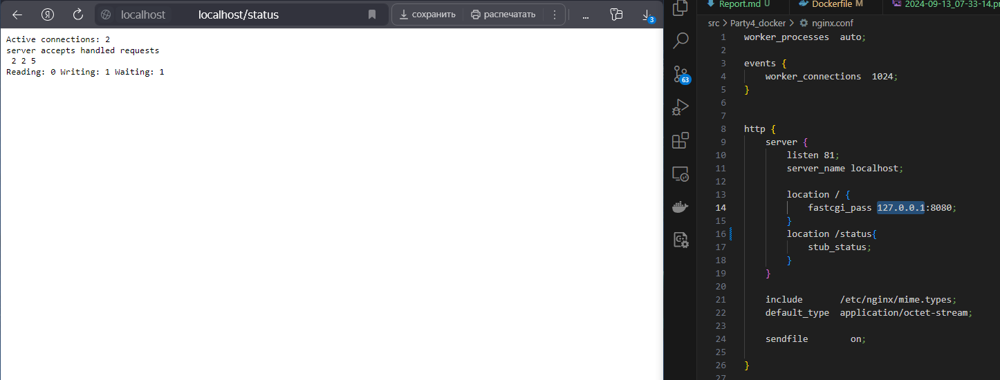

##  Dockle

Просканируй образ из предыдущего задания через dockle
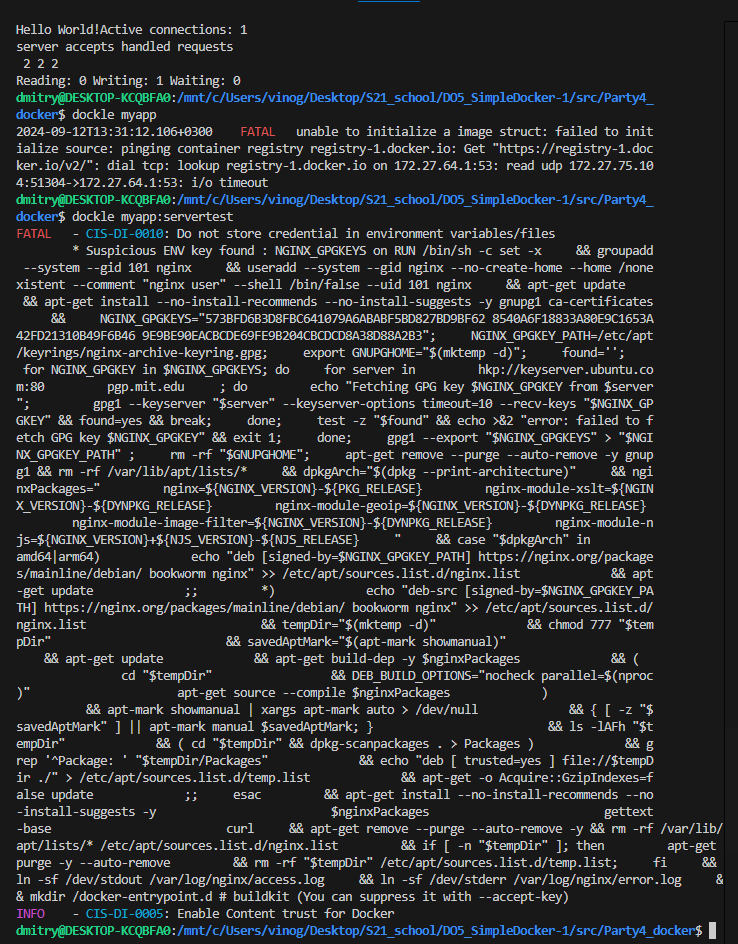

Исправь образ так, чтобы при проверке через dockle не было ошибок и предупреждений.
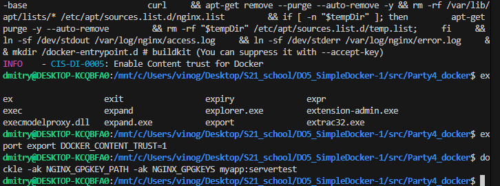

## Базовый Docker Compose
1) Подними докер-контейнер из Части 5 (он должен работать в локальной сети, т. е. не нужно использовать инструкцию EXPOSE и мапить порты на локальную машину).
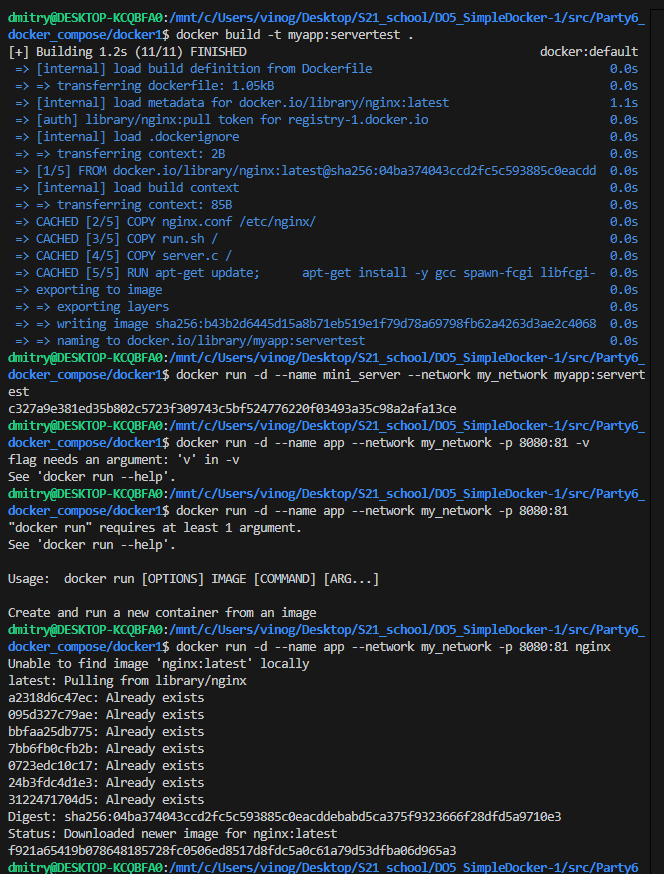

2) Подними докер-контейнер с nginx, который будет проксировать все запросы с 8080 порта на 81 порт первого контейнера.Замапь 8080 порт второго контейнера на 80 порт локальной машины.
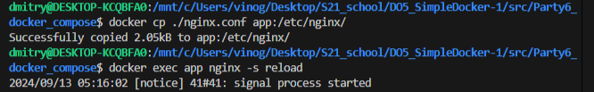

Собери и запусти проект с помощью команд docker-compose build и docker-compose up. Проверь, что в браузере по localhost:80 отдается написанная тобой страничка, как и ранее.
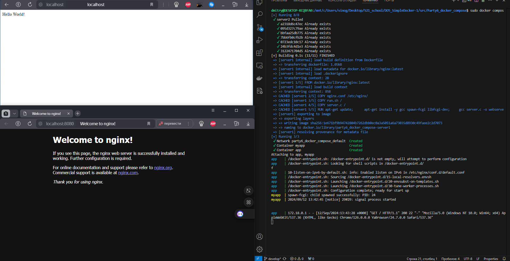
